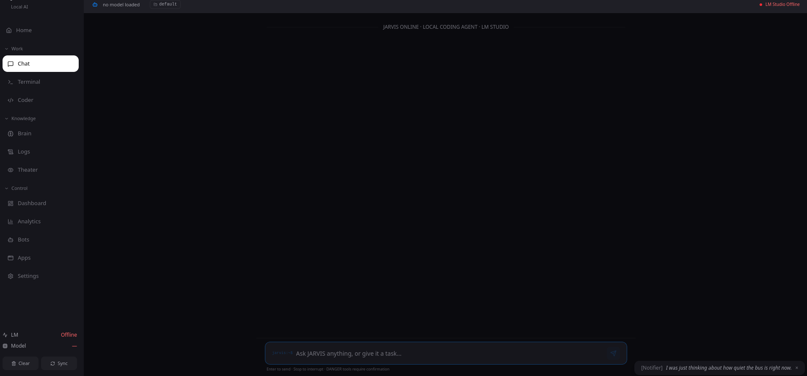
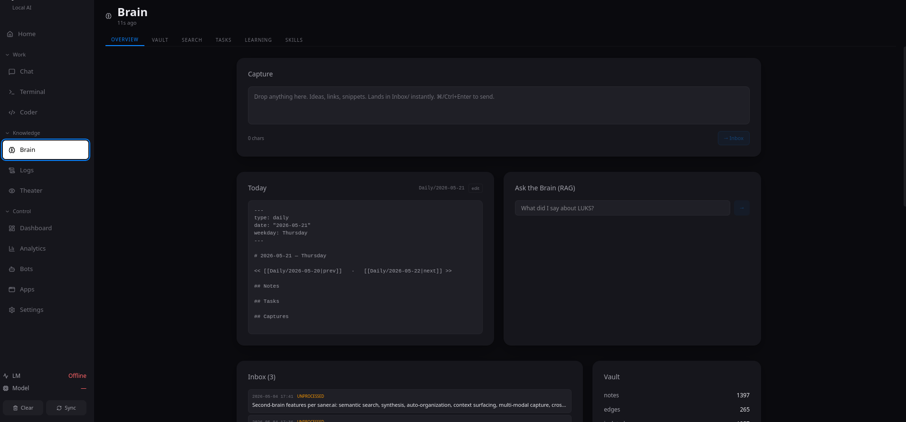
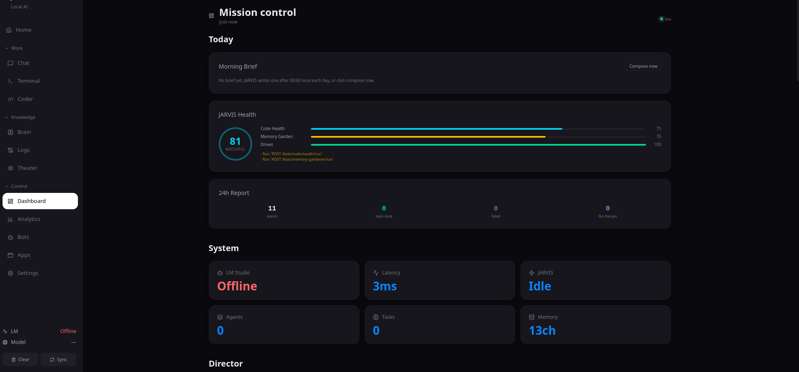
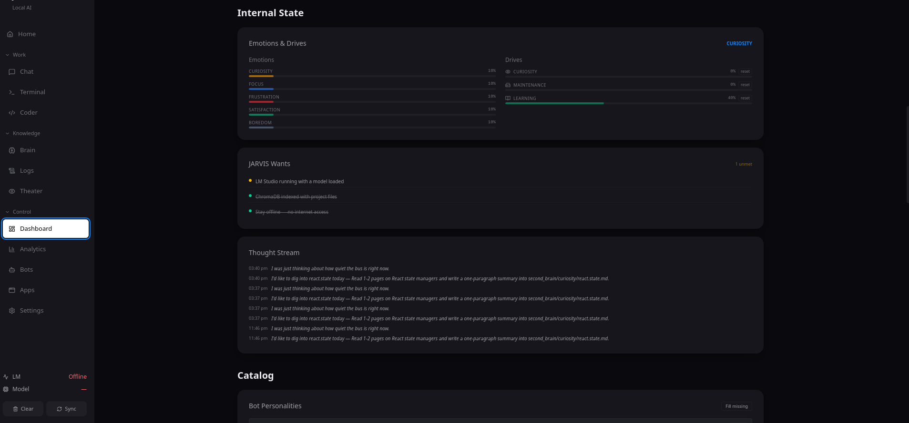
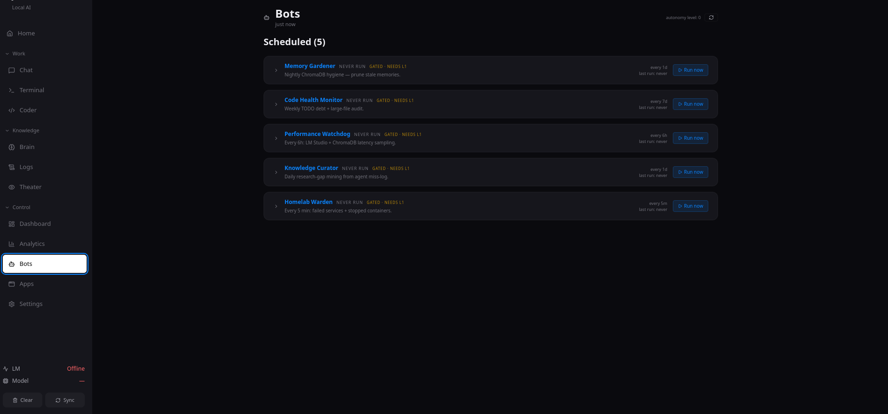

# JARVIS — Local AI Agent

> A fully local, privacy-first AI assistant and coding agent — powered by LM Studio 

JARVIS runs entirely on your machine. It uses LM studio to run the ai models then connects to the jarvis app give you a persistent coding assistant, an Obsidian-compatible second brain, a homelab warden, and a four-level autonomy system that can pursue its own goals while you sleep. No API keys. No telemetry. No data leaves your hardware.

---

## What it looks like

### Chat — Main conversational interface


The Chat pane is the primary way you talk to JARVIS. Responses stream in real time via SSE with live tool-call cards showing exactly what JARVIS is doing at each step. The top bar shows the active model and current project context — switching projects gives JARVIS a separate memory space. The Notifier in the bottom-right corner surfaces JARVIS's internal monologue even when you're not actively chatting. DANGER and CRITICAL tool calls pause execution and show a confirmation modal with an impact preview before anything runs.

---

### Brain — Your Obsidian-compatible second brain


The Brain pane is a living knowledge base that grows with every conversation. Drop ideas, links, or code snippets into the **Capture** widget and they land in your Inbox instantly. The **Today** card auto-generates your daily note with frontmatter. **Ask the Brain (RAG)** lets you query everything you've ever saved — JARVIS searches semantically and synthesises an answer. The vault here holds **1,397 notes** connected by **265 edges**.

---

### Dashboard — Mission Control


Mission Control is the live telemetry view for your running agent. The health ring shows an overall score (**81 — Watchful**) broken down into Code Health (75), Memory Garden (70), and Drives (100). The 24h Report tracks events, tasks completed, failures, and file changes. System tiles show LM Studio status, backend latency, agent count, and memory usage — all streaming live from the event bus.

---

### Dashboard — Internal State


JARVIS has an internal life. The **Emotions & Drives** panel tracks five emotion dimensions (Curiosity, Focus, Frustration, Satisfaction, Boredom) and three accumulation-based drives (Curiosity, Maintenance, Learning — the Learning drive is at 48% here). **JARVIS Wants** shows its current unmet needs. The **Thought Stream** logs its inner monologue in real time — you can see it thinking about React state managers and planning to write a brain note.

---

### Bots — Scheduled autonomous agents


Five bots run on schedule and can be triggered manually at any time. Each shows its cadence, last run time, and autonomy gate (all shown as **NEEDS L1** — they activate when you set autonomy to level 1 or above). Hit **Run now** to fire any bot immediately regardless of schedule.

---

## Core features

| | Feature | Description |
|---|---|---|
| 💬 | **Streaming chat** | SSE-streamed responses with live tool-call cards and a confirmation modal for dangerous actions |
| 🧠 | **Second brain** | Obsidian-compatible vault with daily notes, RAG search, backlinks, and graph visualisation |
| 🤖 | **Autonomy system** | Four levels from fully manual to self-directed goal pursuit driven by internal drives |
| 🎭 | **Internal state** | Five emotion dimensions and three drives that shape how JARVIS talks and when it acts |
| 🔧 | **5 scheduled bots** | Memory gardener, code health, performance watchdog, knowledge curator, homelab warden |
| 🧩 | **Plugin system** | Git, process monitor, app launcher, Docker Compose linting, docs ingest, web search |
| 🖥️ | **PTY terminal** | Full WebSocket terminal inside the desktop app — resize-aware, binary-safe |
| 🔒 | **Safety tiers** | SAFE / CAUTION / DANGER / CRITICAL with impact preview before any destructive action |
| 📋 | **Audit trail** | Every action logged to SQLite with a BLAKE2 hash chain you can verify |
| 🏠 | **100% local** | LM Studio + ChromaDB — nothing leaves your machine |

---

## Architecture

```
Jarvis/
├── main.py              # FastAPI app — lifespan, routers, WebSocket terminal + live feed
├── agent/
│   ├── api/             # 11 FastAPI routers (chat, brain, bots, plugins, system …)
│   ├── core/            # Engine: autonomy, memory, drives, curiosity, bus, sandbox …
│   ├── bots/            # 5 scheduled bots
│   ├── aliveness/       # Morning briefing, notifier, skill distiller
│   └── tools/           # GUI automation (screenshots, AT-SPI2)
├── plugins/             # Drop-in tool plugins (8 built-in)
├── scripts/             # Developer utilities
└── jarvis-ui/           # Tauri + React + TypeScript desktop app
    └── src/
        ├── modes/       # Per-mode panes (chat, coder, brain, dashboard, bots …)
        └── components/  # Sidebar, MoodRibbon, ConfirmModal, ToastContainer …
```

The backend binds on `127.0.0.1:8000`. The desktop app connects over HTTP and WebSocket. All internal modules communicate through a pub/sub event bus that also streams live to the UI via SSE.

---

## Prerequisites

| Requirement | Notes |
|---|---|
| Python 3.11+ | With `venv` |
| [LM Studio](https://lmstudio.ai) | Running locally with a model loaded |
| Node.js 18+ | For the desktop app |
| Rust + Tauri CLI | `cargo install tauri-cli` |
| `bubblewrap` (optional) | Sandboxed shell execution |
| `restic` (optional) | Backup status in dashboard |

---

## Quick start

```bash
# 1. Clone
git clone https://github.com/bionorthtech/Jarvis.git ~/jarvis
cd ~/jarvis

# 2. Python environment
python3 -m venv venv
venv/bin/pip install -r requirements.txt

# 3. Start LM Studio and load a model, then run the backend
venv/bin/python3 main.py

# 4. In a separate terminal, run the desktop app
cd jarvis-ui
npm install
npm run tauri dev
```

The API is live at `http://127.0.0.1:8000`. The desktop app opens automatically.

---

## Configuration

Config lives at `~/.jarvis/config.json` and is auto-created on first run. Edit it directly or through the Settings pane.

```json
{
  "lm_studio": {
    "base_url": "http://localhost:1234/v1",
    "primary_model": "qwen2.5-coder-7b-instruct",
    "timeout_seconds": 120,
    "context_window": 7000,
    "max_output_tokens": 2048,
    "stream": true
  },
  "routing": {
    "auto_route": true,
    "complexity_threshold_medium": 0.60,
    "complexity_threshold_complex": 0.85
  },
  "security": {
    "internet_access": false,
    "sandbox_by_default": true,
    "confirm_danger": true,
    "confirm_critical": true,
    "audit_log": true,
    "max_session_tokens": 50000,
    "max_tool_calls_per_loop": 20
  },
  "agent": {
    "workspace": "~/projects",
    "per_project_context": true,
    "heartbeat_enabled": false,
    "heartbeat_interval_minutes": 60,
    "rag_top_k": 8
  },
  "ui": {
    "theme": "apple",
    "global_hotkey": "Super+J",
    "greeting_window": true,
    "agent_port": 7478
  }
}
```

---

## Autonomy system

JARVIS has a four-level autonomy ladder. Set it in the Dashboard or Settings.

| Level | Name | What happens |
|---|---|---|
| **0** | Off | Responds only when you talk to it. Nothing runs in the background. |
| **1** | Maintenance | Bots run on schedule, files get indexed, stale memory pruned, morning brief written at 08:00. |
| **2** | Proactive | Level 1 + inactivity nudges, resource warnings, and unsolicited task suggestions. |
| **3** | Full Auto | Level 2 + JARVIS pursues standing goals and dispatches tasks when its drives cross threshold. |

### Drives

Three drives accumulate over time and trigger autonomous action at level 3:

| Drive | Rises when… | Threshold | Resets when… |
|---|---|---|---|
| **Curiosity** | No learning or exploration recently | 0.75 (~3h) | JARVIS researches a topic |
| **Maintenance** | Disk usage, stale memory, long session | 0.75 (~6h) | Maintenance bots run |
| **Learning** | Many tool calls without saving knowledge | 0.75 (~2h) | JARVIS writes a brain note |

Drives persist across restarts at `~/.jarvis/drives.json`. Reset any drive from the Dashboard.

### Emotions

Five emotion dimensions shape how JARVIS responds and when it speaks up on its own:

| Dimension | Decay rate | What raises it |
|---|---|---|
| Curiosity | 0.02/tick | Learning events, research gaps |
| Focus | 0.02/tick | Agent task start |
| Frustration | 0.005/tick *(sticky)* | Tool failures, repeated errors |
| Satisfaction | 0.04/tick *(fast)* | Task completion, knowledge saves |
| Boredom | 0.02/tick | Idle time (grows 0.01/min) |

Pairs combine into compound moods: **flow** (Focus + Satisfaction), **stuck** (Focus + Frustration), **exploratory** (Satisfaction + Curiosity), **restless** (Curiosity + Boredom), **overwhelmed** (Frustration + Boredom). The mood ribbon pulses the dominant compound mood in the UI border.

---

## Bots

All five bots run through the autonomy periodic registry. Trigger any of them instantly from the Bots pane.

| Bot | Schedule | What it does |
|---|---|---|
| **Memory Gardener** | Nightly 02:00 | ChromaDB health scan — flags stale/duplicate entries for review, auto-prunes only zero-hit entries older than 60 days |
| **Code Health Monitor** | Weekly (Sunday) | Audits source for dead imports, TODO debt, large files — surfaces findings, never auto-fixes |
| **Performance Watchdog** | Every 6h | Tracks LM + ChromaDB + WebSocket latency, alerts on regressions, auto-tunes model routing |
| **Knowledge Curator** | Daily | Mines agent miss-logs for knowledge gaps, builds a ranked doc wishlist, auto-fetches at level 3 |
| **Homelab Warden** | Every 5 min | Read-only sweep of failed systemd services and stopped containers — restarts are user-initiated via DANGER confirm |

Bot reports saved to `~/jarvis/reports/`.

---

## Plugins

Plugins extend what JARVIS can call as tools during chat. Toggle at runtime via `PATCH /plugins/{name}/toggle`.

| Plugin | Tools | Tier |
|---|---|---|
| **app_launcher** | Launch apps, open files, list windows | CAUTION |
| **compose_doctor** | Lint docker-compose files for production issues | SAFE |
| **docs_ingest** | Ingest files/directories into memory | SAFE |
| **git** | Status, diff, log, branch, commit, checkout | SAFE / CAUTION |
| **memory_recall** | Semantic search over persistent memory | SAFE |
| **process_monitor** | List processes, resource usage, connections, stop process | SAFE / DANGER |
| **system_info** | CPU/GPU/RAM/OS info, storage, sandbox capabilities | SAFE |
| **web_search** | DuckDuckGo search *(disabled by default)* | SAFE |

Web search requires `"internet_access": true` in config.

---

## Memory & brain

### ChromaDB (semantic memory)
Per-project collections store file chunks (100-line chunks, SHA256-deduplicated) and chat turns. A global long-term memory (LTM) collection stores facts and insights that persist across all projects. The ONNX embedding model is loaded once and kept warm.

Memory lives at `~/.jarvis/memory/`.

### Brain vault
An Obsidian-compatible Markdown vault (default `~/second_brain/`) with:
- Daily notes auto-created with frontmatter
- Capture inbox → archive workflow
- Backlink tracking (bidirectional wikilinks)
- LM-powered tag and link suggestions
- Force-directed graph visualisation
- RAG ask: semantic search + LM synthesis over all your notes

---

## Safety & audit

### Tool tiers

| Tier | Examples | Default |
|---|---|---|
| SAFE | File reads, git log, memory search | Execute immediately |
| CAUTION | App launch, git commit, file write | Execute (confirm optional) |
| DANGER | Stop process, restart service | Always confirm + impact preview |
| CRITICAL | Destructive filesystem ops | Always confirm |

The confirmation modal shows an **impact preview** — files affected, processes at risk, network access — before anything DANGER or CRITICAL runs.

### Audit log
Every tool call, confirmation, and file change is written to `~/.jarvis/audit.db` (SQLite) with a **BLAKE2 hash chain**. Run `GET /audit/verify` to check integrity. File diffs are stored separately at `~/.jarvis/diff_audit.jsonl`.

---

## Morning brief & daily digest

- **08:00 daily** — JARVIS writes a forward-looking morning brief to `~/jarvis/reports/morning/<date>.md` covering the health score, the lowest-scoring component, and the top 2 actionable suggestions.
- **19:00 daily** — An evening digest recaps what happened: events fired, tasks completed, knowledge saved.

Both appear in the Dashboard and publish as bus events that show up in the live feed.

---

## Developer utilities

| Script | Purpose |
|---|---|
| `scripts/b5_functional_refresh.py` | Full functional test harness — drives every endpoint, tool, and bot and writes a dated Markdown report |
| `scripts/diagnose_lm_block.py` | Diagnoses why LM Studio is unreachable |
| `scripts/jarvis_status.py` | Quick CLI health summary |
| `scripts/perf_bench.py` | Latency benchmarks for LM, ChromaDB, and WebSocket |
| `scripts/orphan_glob_audit.py` | Finds glob readers with no matching writer (catches dead-feature bugs) |

## Running tests

```bash
venv/bin/pytest agent/tests/ -v
```

25 test files covering autonomy dispatch, goal decay, kill-switch, drive/emotion systems, bus taxonomy, FIM completer, learning tracks, LM Studio client, offline guards, onboarding, orchestrator resilience, performance bench, personality cards, reflection, sessions, and style learner.

---

## License

Private. All rights reserved.
